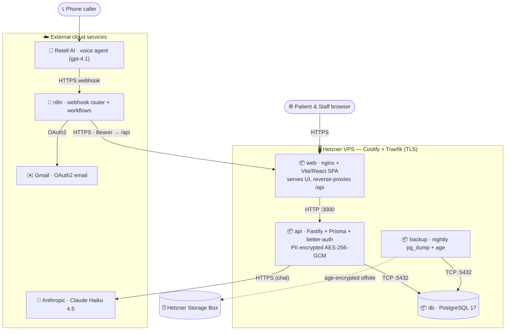

# Plan: Add an "Under the hood" deployment-architecture section to the user guide

## Context

The trilingual user guide (`docs/user-guide.md` + `.hu.md` + `.de.md`) explains what the app does
for a clinic audience, but it never shows **how the whole system is deployed**. The guide is a
portfolio piece, so a UML-style deployment diagram — Retell voice agent, the app on a Hetzner VPS
with PostgreSQL, and the n8n workflow layer — demonstrably showcases the architecture behind the
product. A technical "Under the hood" section was added to **all three language guides** so the
existing EN/HU/DE parity is preserved.

The guides already embed two mermaid `flowchart` diagrams and the portfolio renderer supports
mermaid, so a mermaid deployment-style diagram is the established, zero-asset-copy pattern
(`scripts/publish-user-guide.mts` only copies referenced `.png`/`.mp3` — inline mermaid needs no
asset, so no regex change is required).

Ground-truth architecture (verified against the repo, not the original premise):
- Web app is **Vite + React 19 + TanStack Router SPA served by nginx** — *not* Next.js.
- Deployed on a **Hetzner VPS via Coolify** (Traefik terminates TLS); one `docker-compose.yml`
  stack = 4 containers: `web` (nginx + SPA, also reverse-proxies `/api` → `api:3000`),
  `api` (Fastify), `db` (PostgreSQL 17, in-stack, `db:5432`), `backup` (nightly `pg_dump` + `age`).
- **Retell** cloud voice agent → **n8n** webhook router → `sunshine.appointer.hu/api` (Bearer auth),
  synchronous request/response; API never calls Retell back.
- **Chat receptionist** is a separate path: browser SSE → Fastify → **Anthropic Claude Haiku 4.5**
  in-process (no n8n hop).
- **Gmail** (OAuth2, from n8n nodes) sends all confirmation/summary/alert email.
- Backups are `age`-encrypted and pushed offsite to a Hetzner Storage Box.

## Files changed

- `docs/user-guide.md` (English master)
- `docs/user-guide.hu.md` (Hungarian)
- `docs/user-guide.de.md` (German)

No script or code changes. No new assets.

## Placement

A new `## Under the hood — how it's deployed` section was inserted **after** the
`## 🔐 How your patients' data is protected` section and **before** `## Frequently asked questions`
in each file. Rationale: the encryption section is already the most technical part of the guide, so
the deployment deep-dive sits naturally at the end of the narrative without interrupting the
plain-English business flow above it.

## The deployment diagram (mermaid)

A deployment-style flowchart using subgraphs as UML "nodes", containers as artifacts inside:

The diagram is followed by a bullet list naming each node/role. HU and DE mirror the EN section,
with translated prose and diagram node labels; technical proper nouns (Retell, n8n, PostgreSQL,
Fastify, nginx, Anthropic, Gmail, Hetzner, Coolify, Traefik, `age`) stay untranslated, and the
mermaid structure/IDs are identical across all three.

## Verification

1. **Mermaid syntax** — confirm each of the three diagrams parses (no unbalanced brackets / bad
   edges).
2. **Local publish + visual check** — per `portfolio-user-guide-pipeline.md`, publish each language
   against LOCAL my-blog (`pnpm guide:publish:en`, `:hu`, `:de` → posts to `http://localhost:3000`)
   and open `/(sunshine-dental|sunshine-dental-hu|sunshine-dental-de)` to confirm the new section
   renders between the data-protection and FAQ sections, the diagram renders in all three languages,
   and nothing else shifted or broke.
3. **No asset regressions** — no new `assets/screenshots/...` references were added (inline mermaid),
   so `scripts/publish-user-guide.mts`'s png/mp3 asset copy is unaffected.
4. If publishing to prod later, remember the ISR/build-cache staleness gotcha (re-save in prod
   `/admin` or redeploy with build cache disabled).
