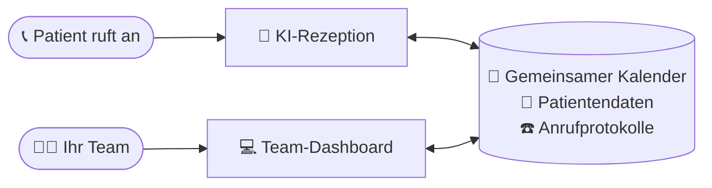
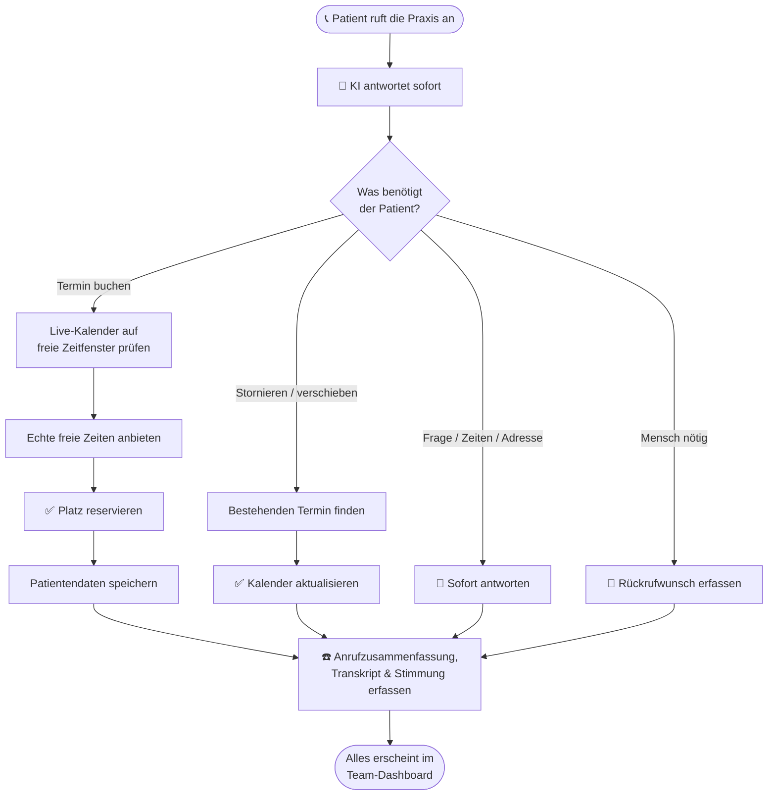

# Sunshine Dental — Benutzerhandbuch

*Eine verständliche Anleitung dazu, was diese App leistet und wie Ihre Praxis sie täglich nutzt.*

---

## Was ist das, in einem Satz?

Es ist eine **rund um die Uhr verfügbare KI-Telefonrezeption für Ihre Zahnarztpraxis, plus ein einfaches Dashboard, mit dem Ihr Team den Kalender, die Patienten und die Anrufe verwaltet** — alles an einem Ort.

Stellen Sie es sich vor wie eine unermüdliche Empfangskraft, die nie schläft, nie in die Mittagspause geht und nie einen Anrufer in der Warteschleife lässt — zusammen mit einer klaren, modernen Verwaltungsoberfläche für Ihr Team.

---

## Die zwei Hälften der App

### 1. Die KI-Telefonrezeption 🤖📞

Wenn ein Patient Ihre Praxis anruft, nimmt ein KI-Sprachassistent ab und führt ein natürliches Gespräch — genau wie mit einer echten Empfangskraft. Sie kann:

- **Häufige Fragen beantworten** („Wie sind die Öffnungszeiten?", „Wo befinden Sie sich?", „Nehmen Sie auch ohne Termin an?")
- **Termine buchen** — sie prüft, wer verfügbar ist, bietet echte freie Zeitfenster an und reserviert den Platz
- **Bestehende Termine stornieren oder verschieben**
- **Daten neuer Patienten aufnehmen** (Name, Telefon, Grund des Besuchs)
- **Rückrufwünsche bearbeiten**, wenn sich ein Mensch melden muss
- **Mehrere Sprachen sprechen**, sodass Sie eine breitere Gemeinschaft bedienen können

Der entscheidende Punkt: Sie arbeitet rund um die Uhr. Ein Patient mit Zahnschmerzen kann sonntags um 21 Uhr noch einen Termin für Montagmorgen buchen — keine verpassten Anrufe, keine volle Mailbox, kein verlorenes Geschäft.

### 2. Das Team-Dashboard 💻

Dies ist die Weboberfläche, in die sich Ihr Team einloggt. Hier behalten die Menschen die Kontrolle über alles, was die KI tut. Von hier aus sieht das Team jeden Termin, verwaltet den Kalender, schlägt Patienten nach und prüft, was bei jedem Anruf geschah.

Die Mitarbeiter melden sich mit ihrer eigenen E-Mail-Adresse und ihrem Passwort an:

---

## Wie alles zusammenpasst

Die KI-Rezeption und Ihr Team-Dashboard teilen sich **einen Kalender und eine Patientenliste** — so bleibt alles automatisch synchron. Die KI übernimmt das Telefon; Ihr Team überwacht vom Dashboard aus.

## Was bei einem Anruf passiert

Hier der Weg eines einzelnen Anrufs — vom Klingeln bis zum gebuchten Termin:

---

## Was Ihr Team im Dashboard tun kann

### 📊 Dashboard (Startbildschirm)
Ein schneller „Wie läuft es heute"-Überblick — die heutigen Termine, Patienten, die auf einen Rückruf warten, wie viele Anrufe diese Woche eingingen und wie zufrieden die Anrufer klangen.

### 📅 Kalender
Das Herz der App. Ein visueller Wochen-/Tages-/Monatskalender, der alle Termine und die Arbeitszeiten jedes Zahnarztes zeigt.

- **Arbeitszeiten festlegen** — markieren, wann jeder Behandler buchbar ist
- **Zeit blockieren** — Mittagspausen, Besprechungen, Verwaltungszeit
- **Urlaube markieren** — freie Tage, damit nichts gebucht wird, während ein Zahnarzt abwesend ist
- **Termine buchen, verschieben oder stornieren** mit einfachen Klicks und Drag-and-drop
- **Alle Behandler nebeneinander** sehen, sodass der Empfang die ganze Praxis auf einen Blick verwaltet

Die KI-Rezeption liest aus demselben Kalender — so bietet sie immer nur Zeitfenster an, die wirklich frei sind. Keine Doppelbuchungen.

### 👥 Patienten
Ein einfaches Adressbuch aller, die die Praxis kontaktiert haben. Die KI fügt neue Anrufer automatisch hier hinzu, und das Team kann suchen, Verläufe einsehen und Daten aktualisieren.

### 📋 Termine
Eine übersichtliche Liste aller Termine — anstehend, abgeschlossen oder storniert. Filtern Sie nach Tag, Zahnarzt oder Patient. Markieren Sie Besuche als abgeschlossen, wenn sie erledigt sind.

### ☎️ Anrufprotokolle
Eine Aufzeichnung jedes Anrufs, den die KI bearbeitet hat, einschließlich:
- Einer schriftlichen **Zusammenfassung** dessen, worum es im Anruf ging
- Des vollständigen **Transkripts** (Wort für Wort), wenn Sie die Details möchten
- Wie sich der Anrufer **fühlte** (positiv / neutral / unzufrieden)
- Ob der Anruf **erfolgreich** war

Dies ist Ihr Fenster zur Qualitätskontrolle — Sie sehen jederzeit genau, was die KI gesagt und getan hat.

### 👤 Benutzer (Admins)
Inhaber und Manager verwalten hier ihr Team — sie legen Mitarbeiterkonten an und bestimmen die Rolle jeder Person.

### ⚙️ Einstellungen
Persönliche Kontoeinstellungen — aktualisieren Sie Ihren Namen, ändern Sie Ihr Passwort und (für Zahnärzte) delegieren Sie Ihren Kalender an eine Assistenz. Sprache sowie helles/dunkles Design lassen sich jederzeit über die obere Leiste umschalten.

---

## Wer nutzt was (Rollen)

Verschiedene Teammitglieder sehen verschiedene Dinge, sodass jeder genau den Zugriff erhält, den er braucht:

| Rolle | Was sie tun |
|------|--------------|
| **Behandler** (Zahnarzt) | Verwaltet den eigenen Kalender und die Verfügbarkeit, sieht die eigenen Termine, markiert Besuche als abgeschlossen |
| **Assistenz** (Empfang) | Verwaltet die ganze Praxis — alle Kalender, alle Termine, Patientendaten und Anrufprotokolle |
| **Admin** (Inhaber / Manager) | Alles oben Genannte, plus das Anlegen von Mitarbeiterkonten und die Verwaltung des Teams |

Ein Zahnarzt kann seinen Kalender auch an eine Assistenz **delegieren** — so kann der Empfang den Terminplan in seinem Namen verwalten.

---

## Ein Tag im Leben

**20:55 Uhr, nach Feierabend.** Ein Patient ruft mit einem abgebrochenen Zahn an. Die KI antwortet, findet den nächsten freien Notfalltermin am nächsten Morgen um 9:00 Uhr bei Dr. Nagy, bucht ihn, nimmt Name und Nummer des Patienten auf und bestätigt. Ohne menschliches Zutun.

**9:05 Uhr am nächsten Morgen.** Die Empfangsassistenz loggt sich ein. Das Dashboard zeigt bereits den neuen 9:00-Uhr-Termin im Kalender und den neuen Patienten im System. Sie liest die Anrufzusammenfassung, sieht, dass alles in Ordnung ist, und bereitet das Behandlungszimmer vor.

**Im Laufe des Tages.** Patienten rufen an, um zu verschieben, nach Öffnungszeiten zu fragen oder Rückrufe zu erbitten. Die KI bearbeitet die Routinefälle; alles Ungewöhnliche wird erfasst, damit das Team nachfassen kann. Das Team verbringt seine Zeit mit den Patienten auf dem Behandlungsstuhl — nicht am Telefon.

---

## Warum Praxen es lieben

- **Kein Anruf geht verloren** — jeder Anruf wird beantwortet, auch nachts, am Wochenende und an Feiertagen
- **Kein Telefon-Pingpong mehr** — Patienten buchen sofort selbst
- **Weniger Nichterscheinen** — Termine werden im Moment der Buchung bestätigt und erfasst
- **Entlasten Sie Ihren Empfang** — das Team konzentriert sich auf die Patienten vor Ort statt aufs Telefon
- **Volle Transparenz** — jeder Anruf wird zusammengefasst und aufgezeichnet, sodass Sie stets die Kontrolle behalten
- **Spricht die Sprachen Ihrer Patienten** — bedienen Sie einen größeren Teil Ihrer Gemeinschaft
- **Ein einfaches System** — Kalender, Patienten und Anrufe an einem Ort (kein Jonglieren mehr mit Tabellen und separaten Kalendern)

---

## Häufig gestellte Fragen

**Ersetzt die KI mein Team?**
Nein — sie übernimmt die wiederkehrende Telefonarbeit, damit sich Ihr Team auf die Patienten konzentrieren kann. Ihr Team behält über das Dashboard die volle Kontrolle.

**Was, wenn die KI einen Anruf nicht bearbeiten kann?**
Sie erfasst die Anfrage (einschließlich Rückrufwünsche), damit ein Mensch nachfassen kann. In den Anrufprotokollen sehen Sie alles.

**Kann ich sehen, was die KI einem Patienten gesagt hat?**
Ja. Zu jedem Anruf gibt es ein vollständiges schriftliches Transkript und eine Zusammenfassung in den Anrufprotokollen.

**Bucht sie uns doppelt?**
Nein. Die KI bucht nur aus Ihrem Live-Kalender, also bietet sie nur Zeiten an, die tatsächlich frei sind.

**Werden Patientendaten vertraulich behandelt?**
Ja. Der Zugriff ist nach Rolle beschränkt, die Konten sind passwortgeschützt, und nur Ihre autorisierten Mitarbeiter können sich anmelden.

---

*Fragen oder Interesse an einer Vorführung? Nehmen Sie Kontakt mit uns auf — wir geben Ihnen gern eine Live-Demo.*
