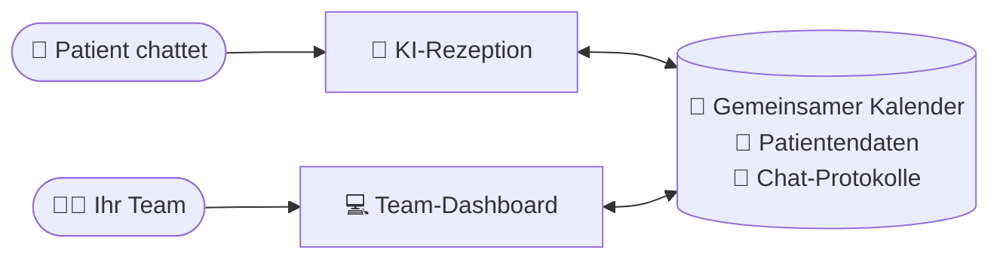
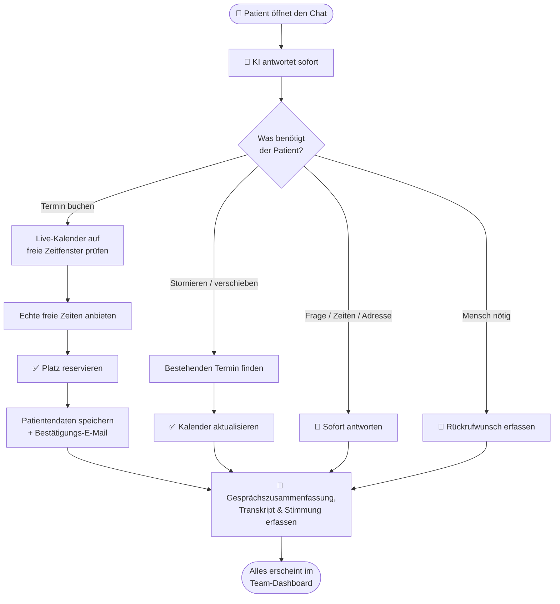
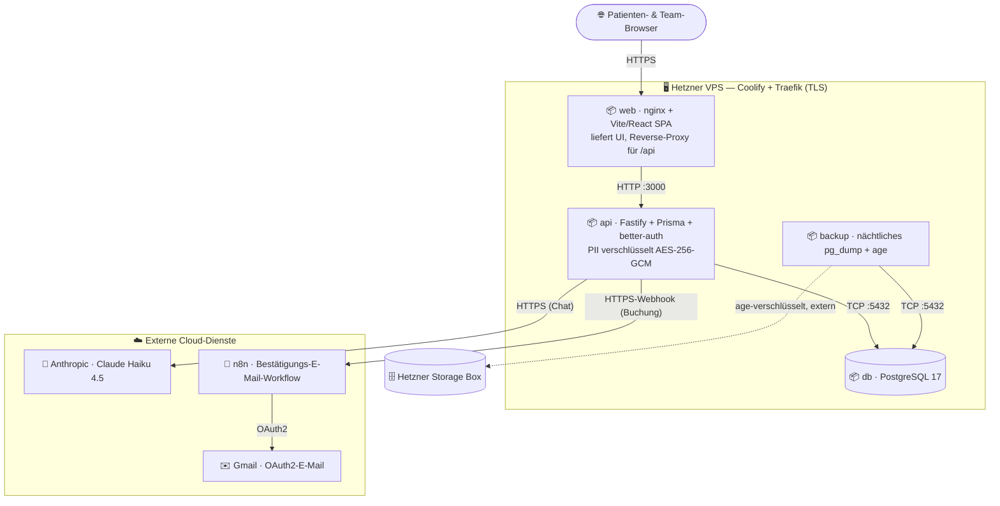

# Sunshine Dental — Benutzerhandbuch

*Eine verständliche Anleitung dazu, was diese App leistet und wie Ihre Praxis sie täglich nutzt.*

---

## Was ist das, in einem Satz?

Es ist eine **rund um die Uhr verfügbare KI-Rezeption für Ihre Zahnarztpraxis — sie chattet mit Patienten auf Ihrer Website — plus ein einfaches Dashboard, mit dem Ihr Team den Kalender, die Patienten und die Gespräche verwaltet** — alles an einem Ort.

Stellen Sie es sich vor wie eine unermüdliche Empfangskraft, die nie schläft, nie in die Mittagspause geht und nie eine Frage unbeantwortet lässt — zusammen mit einer klaren, modernen Verwaltungsoberfläche für Ihr Team.

---

## Die zwei Teile der App

### 1. Die Chat-Rezeption 💬

Die KI-Rezeption lebt als **Text-Chat** auf Ihrer Website. Sie begrüßt Besucher, führt ein natürliches Gespräch und arbeitet aus Ihrem Live-Kalender — in der Sprache des Patienten (direkt im Chat-Kopf umschaltbar). Sie kann:

- **Häufige Fragen beantworten** („Wie sind die Öffnungszeiten?", „Wo befinden Sie sich?", „Nehmen Sie auch ohne Termin an?")
- **Termine buchen** — sie prüft, wer verfügbar ist, bietet echte freie Zeitfenster an und reserviert den Platz
- **Bestehende Termine stornieren oder verschieben**
- **Daten neuer Patienten aufnehmen** (Name, Telefon, Grund des Besuchs)
- **Rückrufwünsche bearbeiten**, wenn sich ein Mensch melden muss
- **Mehrere Sprachen schreiben**, sodass Sie eine breitere Gemeinschaft bedienen können

Der entscheidende Punkt: Sie arbeitet rund um die Uhr. Ein Patient mit Zahnschmerzen kann sonntags um 21 Uhr noch einen Termin für Montagmorgen buchen — keine unbeantworteten Nachrichten, kein liegengebliebenes Kontaktformular, kein verlorenes Geschäft.

Ein paar weitere Dinge, die Sie wissen sollten:

- **Vor jeder Buchung fragt sie nach einer E-Mail-Adresse**, sodass jede Buchung automatisch eine Bestätigungs-E-Mail erhält — nichts bleibt unbestätigt.
- **Patienten können sie wie eine App installieren** — ein Tipp im Browser genügt, und Ihre Praxis bekommt ein eigenes Symbol auf dem Startbildschirm, ganz ohne App Store.
- **Jedes Gespräch wird zusammengefasst und protokolliert** (siehe Chat-Protokolle weiter unten).

### 2. Das Team-Dashboard 💻

Dies ist die Weboberfläche, in die sich Ihr Team einloggt. Hier behalten die Menschen die Kontrolle über alles, was die KI tut. Von hier aus sieht das Team jeden Termin, verwaltet den Kalender, schlägt Patienten nach und prüft jedes Gespräch, das die Rezeption geführt hat.

Die Mitarbeiter melden sich mit ihrer eigenen E-Mail-Adresse und ihrem Passwort an:

---

## Wie alles zusammenpasst

Die KI-Rezeption und Ihr Team-Dashboard teilen sich **einen Kalender und eine Patientenliste** — so bleibt alles automatisch synchron. Die KI führt die Gespräche; Ihr Team überwacht vom Dashboard aus.

## Was in einem Gespräch passiert

Hier der Weg eines einzelnen Chats — von der Begrüßung bis zum gebuchten Termin:

---

## Was Ihr Team im Dashboard tun kann

### 📊 Dashboard (Startbildschirm)
Ein schneller „Wie läuft es heute"-Überblick — die heutigen Termine, Patienten, die auf einen Rückruf warten, wie viele Gespräche diese Woche eingingen und wie zufrieden die Patienten wirkten.

### 📅 Kalender
Das Herz der App. Ein visueller Wochen-/Tages-/Monatskalender, der alle Termine und die Arbeitszeiten jedes Zahnarztes zeigt.

- **Arbeitszeiten festlegen** — markieren, wann jeder Behandler buchbar ist
- **Zeit blockieren** — Mittagspausen, Besprechungen, Verwaltungszeit
- **Urlaube markieren** — freie Tage, damit nichts gebucht wird, während ein Zahnarzt abwesend ist
- **Termine buchen, verschieben oder stornieren** mit einfachen Klicks und Drag-and-drop
- **Alle Behandler nebeneinander** sehen, sodass der Empfang die ganze Praxis auf einen Blick verwaltet

Die KI-Rezeption liest aus demselben Kalender — so bietet sie immer nur Zeitfenster an, die wirklich frei sind. Keine Doppelbuchungen.

### 👥 Patienten
Ein einfaches Adressbuch aller, die die Praxis kontaktiert haben. Die KI fügt neue Patienten automatisch hier hinzu, und das Team kann suchen, Verläufe einsehen und Daten aktualisieren.

### 📋 Termine
Eine übersichtliche Liste aller Termine — anstehend, abgeschlossen oder storniert. Filtern Sie nach Tag, Zahnarzt oder Patient. Markieren Sie Besuche als abgeschlossen, wenn sie erledigt sind.

### 💬 Chat-Protokolle
Eine Aufzeichnung jedes Gesprächs, das die KI bearbeitet hat, einschließlich:
- Einer schriftlichen **Zusammenfassung** dessen, worum es ging — in der Sprache des Patienten
- Des vollständigen **Transkripts** (Wort für Wort), wenn Sie die Details möchten
- Der **Sprache**, in der der Patient geschrieben hat, und wie viele Nachrichten es waren
- Wie sich der Patient **fühlte** (positiv / neutral / unzufrieden)
- Ob das Gespräch **erfolgreich** war

Dies ist Ihr Fenster zur Qualitätskontrolle — Sie sehen jederzeit genau, was die KI gesagt und getan hat.

### 👤 Benutzer (Admins)
Inhaber und Manager verwalten hier ihr Team — sie legen Mitarbeiterkonten an und bestimmen die Rolle jeder Person.

### ⚙️ Einstellungen
Persönliche Kontoeinstellungen — aktualisieren Sie Ihren Namen, ändern Sie Ihr Passwort und (für Zahnärzte) delegieren Sie Ihren Kalender an eine Assistenz. Sprache sowie helles/dunkles Design lassen sich jederzeit über die obere Leiste umschalten.

---

## Wer nutzt was (Rollen)

Verschiedene Teammitglieder sehen verschiedene Dinge, sodass jeder genau den Zugriff erhält, den er braucht:

| Rolle | Was sie tun |
|------|--------------|
| **Behandler** (Zahnarzt) | Verwaltet den eigenen Kalender und die Verfügbarkeit, sieht die eigenen Termine, markiert Besuche als abgeschlossen |
| **Assistenz** (Empfang) | Verwaltet die ganze Praxis — alle Kalender, alle Termine, Patientendaten und Chat-Protokolle |
| **Admin** (Inhaber / Manager) | Alles oben Genannte, plus das Anlegen von Mitarbeiterkonten und die Verwaltung des Teams |

Ein Zahnarzt kann seinen Kalender auch an eine Assistenz **delegieren** — so kann der Empfang den Terminplan in seinem Namen verwalten.

---

## Ein Tag im Leben

**20:55 Uhr, nach Feierabend.** Ein Patient mit einem abgebrochenen Zahn öffnet den Chat auf Ihrer Website. Die KI antwortet, findet den nächsten freien Notfalltermin am nächsten Morgen um 9:00 Uhr bei Dr. Nagy, bucht ihn, nimmt Name, Telefonnummer und E-Mail-Adresse des Patienten auf und schickt eine Bestätigung. Ohne menschliches Zutun.

**9:05 Uhr am nächsten Morgen.** Die Empfangsassistenz loggt sich ein. Das Dashboard zeigt bereits den neuen 9:00-Uhr-Termin im Kalender und den neuen Patienten im System. Sie liest die Gesprächszusammenfassung, sieht, dass alles in Ordnung ist, und bereitet das Behandlungszimmer vor.

**Im Laufe des Tages.** Patienten schreiben, um zu verschieben, nach Öffnungszeiten zu fragen oder Rückrufe zu erbitten. Die KI bearbeitet die Routinefälle; alles Ungewöhnliche wird erfasst, damit das Team nachfassen kann. Das Team verbringt seine Zeit mit den Patienten auf dem Behandlungsstuhl — nicht am Telefon.

---

## Warum Praxen es lieben

- **Keine Anfrage geht verloren** — jede Nachricht wird beantwortet, auch nachts, am Wochenende und an Feiertagen
- **Kein Telefon-Pingpong mehr** — Patienten buchen sofort selbst, ohne Warteschleife
- **Weniger Nichterscheinen** — Termine werden im Moment der Buchung per E-Mail bestätigt
- **Entlasten Sie Ihren Empfang** — das Team konzentriert sich auf die Patienten vor Ort statt aufs Telefon
- **Volle Transparenz** — jedes Gespräch wird zusammengefasst und aufgezeichnet, sodass Sie stets die Kontrolle behalten
- **Schreibt in den Sprachen Ihrer Patienten** — bedienen Sie einen größeren Teil Ihrer Gemeinschaft, schriftlich und nachlesbar
- **Immer auf Ihrer Website** — Patienten buchen von der Seite aus, die sie ohnehin gerade ansehen, auf jedem Gerät
- **Patientendaten bleiben wirklich privat** — verschlüsselt mit einem Schlüssel, den nur Ihre Praxis besitzt, und jede Nacht gesichert
- **Ein einfaches System** — Kalender, Patienten und Gespräche an einem Ort (kein Jonglieren mehr mit Tabellen und separaten Kalendern)

---

## 🔐 So sind die Daten Ihrer Patienten geschützt

Patientendaten sind Gesundheitsdaten, und diese App behandelt sie auch so — mit einem Schutz, den Sie einem Patienten in einem Satz erklären können.

### Verschlüsselt — mit einem Schlüssel, den nur Ihre Praxis besitzt

Alle persönlichen Patientendaten (Namen, Telefonnummern, Terminnotizen, Chat-Transkripte) werden **verschlüsselt** gespeichert, mit AES-256 — derselben Verschlüsselungsfamilie, die auch beim Online-Banking zum Einsatz kommt. Der Schlüssel gehört **allein Ihrer Praxis**: Er wird nie auf dem Server gespeichert und liegt auch nicht bei uns. Praktisch heißt das: Wer die Datenbank stiehlt — oder sogar die Festplatten des Servers —, sieht nur unlesbaren Zeichensalat.

Das hat auch eine sichtbare, alltägliche Seite: Wenn das System neu startet (zum Beispiel nach einem Update), kommt es **gesperrt** zurück. Das Team kann sich weiter anmelden und den Kalender sehen, aber Patientennamen erscheinen als `••••`, bis ein Administrator den Praxis-Schlüssel eingibt — eine Routine von 10 Sekunden:

Der Hinweisbalken zeigt sogar einen kurzen „Fingerabdruck" des erwarteten Schlüssels, sodass der Admin auf einen Blick erkennt, dass er den richtigen verwendet — ohne dass der Schlüssel selbst je angezeigt wird.

### Jede Nacht gesichert — in einer Form, die nicht einmal wir lesen können

Jede Nacht um 3 Uhr sichert das System automatisch die **gesamte Datenbank**, verschlüsselt die Sicherung und bewahrt 90 Tage Verlauf auf. Der Clou: Die Sicherungen sind mit einem Verfahren verschlüsselt, mit dem der Server sie zwar *erstellen*, aber nie *zurücklesen* kann — öffnen lässt sich eine Sicherung nur mit dem versiegelten **Wiederherstellungsschlüssel** Ihrer Praxis (einem gedruckten Dokument im Praxistresor).

- **Geht der Server je verloren** (Hardwaredefekt, Katastrophe), wird die neueste Sicherung wiederhergestellt und mit Ihrem gewohnten Schlüssel entsperrt. Dieses Verfahren ist keine Theorie — es wird in regelmäßigen „Feuerübungen" geprobt.
- **Verliert die Praxis je ihren Schlüssel**, lässt er sich mit dem versiegelten Dokument aus dem Tresor wiederherstellen. Kein Datenverlust, kein Anruf beim Anbieter für eine Kopie — wir hatten nie eine.
- Und wenn *beides* verloren geht? Dann sind die Daten unwiederbringlich — **mit Absicht**. Das ist kein Mangel, sondern der Beweis, dass niemand außerhalb Ihrer Praxis je die Daten Ihrer Patienten lesen kann.

---

## Unter der Haube — wie es bereitgestellt ist

*Für technisch Interessierte: Hier ist das tatsächliche System hinter der freundlichen Rezeption.* Das gesamte Produkt läuft als kleine Gruppe von Docker-Containern auf einem einzigen **Hetzner VPS** (verwaltet mit Coolify, das auch HTTPS am Rand terminiert) und kommuniziert mit zwei spezialisierten Cloud-Diensten für Chat und E-Mail.

- **Hetzner VPS (Coolify + Traefik)** — ein Docker-Stack mit TLS am Rand. Genau derselbe Stack wird zweimal bereitgestellt, als vollständig getrennte Produktions- (`sunshine.appointer.hu`) und Staging-Umgebung (`sunshinedev.appointer.hu`).
- **`web`- / `api`- / `db`- / `backup`-Container** — nginx liefert die React-Single-Page-App und stellt einen Reverse-Proxy für `/api` bereit; eine Fastify-API enthält die Geschäftslogik; eine im Stack laufende PostgreSQL-17-Datenbank speichert alles; und ein nächtlicher Job erstellt eine verschlüsselte Sicherung.
- **Anthropic Claude Haiku 4.5** — die Rezeption selbst. Die API spricht direkt mit Claude und führt die Buchungswerkzeuge im eigenen Prozess auf demselben Kalender aus, den auch das Dashboard nutzt — zwischen der Anfrage eines Patienten und der Antwort des Kalenders liegt also kein Workflow-Umweg.
- **n8n → Gmail (OAuth2)** — Buchungsbestätigungen und Fehlerbenachrichtigungen. Das ist das Einzige, was außerhalb des Stacks verbleibt, und es versendet nur E-Mails; im Buchungsweg hängt nichts davon ab, dass es läuft.
- **Verschlüsselung mit praxiseigenen Schlüsseln** — Patientendaten werden mit einem Schlüssel verschlüsselt, den nur die Praxis besitzt, und die nächtlichen Sicherungen werden mit einem separaten externen Schlüssel versiegelt (siehe oben: *So sind die Daten Ihrer Patienten geschützt*).

---

## Häufig gestellte Fragen

**Ersetzt die KI mein Team?**
Nein — sie übernimmt die wiederkehrende Empfangsarbeit, damit sich Ihr Team auf die Patienten konzentrieren kann. Ihr Team behält über das Dashboard die volle Kontrolle.

**Was, wenn die KI eine Anfrage nicht bearbeiten kann?**
Sie erfasst die Anfrage (einschließlich Rückrufwünsche), damit ein Mensch nachfassen kann. In den Chat-Protokollen sehen Sie alles.

**Kann ich sehen, was die KI einem Patienten gesagt hat?**
Ja. Zu jedem Gespräch gibt es ein vollständiges schriftliches Transkript und eine Zusammenfassung in den Chat-Protokollen.

**Und Patienten, die lieber anrufen möchten?**
Sie wählen weiterhin die gewohnte Nummer Ihrer Praxis und erreichen Ihr Team, genau wie bisher — die App sitzt nicht vor Ihrer Telefonleitung. Der Chat fängt die Anfragen ab, aus denen sonst Mailbox-Nachrichten, verpasste Anrufe oder unbeantwortete Kontaktformulare würden.

**Bucht sie uns doppelt?**
Nein. Die KI bucht nur aus Ihrem Live-Kalender, also bietet sie nur Zeiten an, die tatsächlich frei sind.

**Werden Patientendaten vertraulich behandelt?**
Ja, auf mehreren Ebenen. Der Zugriff ist nach Rolle und Passwort beschränkt. Darüber hinaus werden alle persönlichen Patientendaten **verschlüsselt** gespeichert, und den Schlüssel besitzt allein Ihre Praxis — nicht wir, nicht der Server. Die nächtlichen Sicherungen sind genauso verschlüsselt. Siehe oben: „So sind die Daten Ihrer Patienten geschützt".

**Was passiert, wenn der KI-Chat nicht weiterhelfen kann oder das System gerade aktualisiert wird?**
Der Chat meldet höflich, dass er vorübergehend nicht verfügbar ist, und nennt die Telefonnummer Ihrer Praxis. Auf Team-Seite „sperren" Updates die Patientendaten kurzzeitig, bis ein Admin den Praxis-Schlüssel erneut eingibt — der Kalender funktioniert währenddessen durchgehend.

---

*Fragen oder Interesse an einer Vorführung? Nehmen Sie Kontakt mit uns auf — wir geben Ihnen gern eine Live-Demo.*
