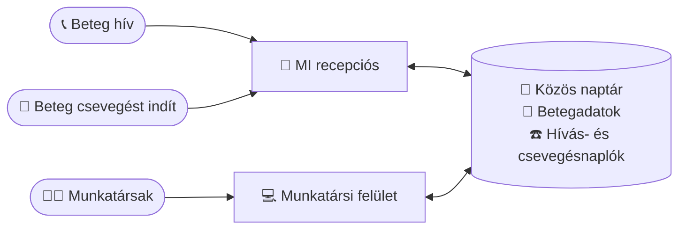
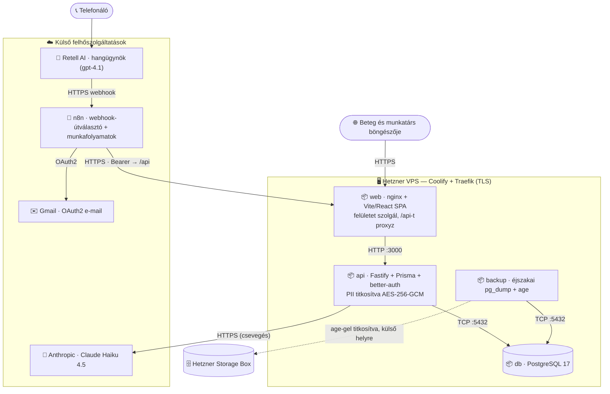

# Sunshine Dental — Felhasználói útmutató

*Közérthető útmutató arról, mit tud ez az alkalmazás, és hogyan használja a rendelője nap mint nap.*

---

## Mi ez, egyetlen mondatban?

Ez egy **éjjel-nappal elérhető, mesterséges intelligenciás recepciós a fogorvosi rendelőjéhez — felveszi a telefont *és* csevegésben is válaszol a weboldalán —, plusz egy egyszerű felület, amellyel a csapata kezeli a naptárat, a betegeket, a hívásokat és a csevegéseket** — mindezt egy helyen.

Képzelje el úgy, mintha felvenne egy fáradhatatlan recepcióst, aki soha nem alszik, soha nem megy ebédelni, és soha nem várakoztatja a hívót — mindezt egy letisztult, modern adminisztrációs felülettel a munkatársai számára.

---

## 🎧 Hallgasson bele egy valódi hívásba

Ne csak a szavunkra hagyatkozzon — íme egy **valódi hívás**, amelyet az MI recepciós elejétől a végéig lebonyolított, a köszönéstől a megerősített időpontig. Nyomja meg a lejátszást, és hallgasson bele.

<audio controls preload="none" src="assets/screenshots/latest-call.mp3"></audio>

👉 **Élőben is kipróbálná?** Szívesen adunk Önnek egy **valódi telefonszámot**, amelyet felhívva saját maga tesztelheti a hangalapú MI recepcióst — pontosan úgy, ahogy a betegei tapasztalnák. Csak kérje.

---

## Az alkalmazás három része

### 1. Az MI telefonos recepciós 🤖📞

Amikor egy beteg felhívja a rendelőt, egy MI hangasszisztens veszi fel a telefont, és természetes beszélgetést folytat — akárcsak egy valódi recepciós. Képes:

- **Megválaszolni a gyakori kérdéseket** („Mik a nyitvatartási idők?", „Hol találhatók?", „Fogadnak előjegyzés nélkül?")
- **Időpontot foglalni** — ellenőrzi, ki elérhető, valódi szabad időpontokat ajánl fel, és lefoglalja a helyet
- **Lemondani vagy átfoglalni** a meglévő időpontokat
- **Felvenni az új beteg adatait** (név, telefonszám, a látogatás oka)
- **Visszahívási kérést kezelni**, ha emberi munkatársnak kell visszajeleznie
- **Több nyelven beszélni**, így szélesebb közösséget szolgálhat ki

A lényeg: éjjel-nappal működik. Egy fájó foggal küzdő beteg vasárnap este 9-kor is tud időpontot foglalni hétfő reggelre — nincs elszalasztott hívás, nincs tele hangposta, nincs elvesztett bevétel.

### 2. A csevegő recepciós 💬

Ugyanez az MI recepciós a weboldalán **szöveges csevegésként** is elérhető — azoknak a betegeknek, akik szívesebben írnak, mint telefonálnak. Köszönti a látogatókat, válaszol a kérdésekre, és ugyanabból az élő naptárból foglal, módosít vagy mond le időpontot, mint a telefonos ügynök — a beteg saját nyelvén (a nyelv a csevegés fejlécében bármikor átváltható).

👉 **Próbálja ki most, ingyen:** [sunshinedev.appointer.hu/chat](https://sunshinedev.appointer.hu/chat) — nyissa meg, és csevegjen a recepcióssal úgy, ahogy a betegei tennék. Kérdezzen rá a nyitvatartásra, vagy foglaljon egy próbaidőpontot; néhány másodperc az egész, és semmibe sem kerül.

Néhány dolog, amit érdemes tudni:

- **Foglalás előtt mindig elkér egy e-mail-címet**, így minden csevegésből származó foglalásról automatikusan visszaigazoló e-mail megy — semmi sem marad megerősítés nélkül.
- **A betegek alkalmazásként is telepíthetik** a telefonjukra (egyetlen koppintással a böngészőből) — a rendelő saját ikont kap a kezdőképernyőjükön, alkalmazásbolt nélkül.
- **Minden beszélgetésről összefoglaló és napló készül** a munkatársak számára, ugyanúgy, mint a telefonhívásokról (lásd lentebb a Csevegésnaplókat).

### 3. A munkatársi felület 💻

Ez az a webes képernyő, amelyre a csapata bejelentkezik. Itt tartják kézben az emberek mindazt, amit az MI csinál. Innen a munkatársak látnak minden időpontot, kezelik a naptárat, betegeket keresnek ki, és átnézik, mi történt minden telefonhívás során.

A munkatársak saját e-mail-címmel és jelszóval jelentkeznek be:

👉 **Nézzen körül maga is a felületen.** Szívesen adunk Önnek teszthozzáférést mind a három szerepkörhöz — **adminisztrátor**, **orvos** és **asszisztens** —, hogy saját szemével lássa, kinek mi jelenik meg: az adminisztrátor a csapatot és a beállításokat is kezeli, az orvos a saját naptárát és időpontjait látja, az asszisztens pedig az egész rendelőt felügyeli. Kérjen belépést, és próbálja ki mindhármat.

---

## Hogyan kapcsolódik mindez össze

Az MI recepciós és a munkatársi felület **egyetlen közös naptárat és egyetlen közös betegnyilvántartást** használ — így minden automatikusan szinkronban marad. Az MI kezeli a telefont; a csapata a felületről felügyel.

## Mi történik egy hívás során

Íme egyetlen telefonhívás útja — a csengéstől a lefoglalt időpontig:

---

## Mit tehet a csapata a felületen

### 📊 Vezérlőpult (kezdőképernyő)
Gyors „hogy állunk ma" áttekintés — a mai időpontok, a visszahívásra váró betegek, hány hívás érkezett ezen a héten, és mennyire elégedetten csengtek le a hívók.

### 📅 Naptár
Az alkalmazás szíve. Vizuális heti/napi/havi naptár, amely megjeleníti az összes időpontot és minden fogorvos munkaidejét.

- **Munkaidő beállítása** — jelölje meg, mikor foglalható az egyes szolgáltatók ideje
- **Idő lefoglalása** — ebédszünetek, megbeszélések, adminisztratív idő
- **Szabadságok megjelölése** — szabadnapok, hogy ne foglaljanak le semmit, amíg a fogorvos távol van
- **Időpontok foglalása, áthelyezése vagy lemondása** egyszerű kattintással és fogd-és-vidd módszerrel
- Lássa **az összes szolgáltatót egymás mellett**, hogy a recepció egy pillantással átlássa az egész rendelőt

Az MI recepciós ugyanezt a naptárat olvassa — így mindig csak a valóban szabad időpontokat ajánlja fel. Nincs dupla foglalás.

### 👥 Betegek
Egyszerű címjegyzék mindenkiről, aki kapcsolatba lépett a rendelővel. Az MI automatikusan ide veszi fel az új hívókat, a munkatársak pedig kereshetnek, megtekinthetik az előzményeket és frissíthetik az adatokat.

### 📋 Időpontok
Letisztult lista minden időpontról — közelgő, befejezett vagy lemondott. Szűrjön nap, fogorvos vagy beteg szerint. Jelölje a látogatásokat befejezettnek, amikor megtörténtek.

### ☎️ Hívásnaplók
Minden telefonhívás rögzítése, amelyet az MI kezelt, beleértve:
- Egy írott **összefoglalót** arról, miről szólt a hívás
- A teljes **átiratot** (szóról szóra), ha kíváncsi a részletekre
- Hogyan **érezte magát** a hívó (pozitív / semleges / elégedetlen)
- Hogy a hívás **sikeres** volt-e

Ez az Ön minőség-ellenőrző ablaka — mindig láthatja pontosan, mit mondott és tett az MI.

### 💬 Csevegésnaplók
Ugyanez az átláthatóság a csevegő recepciósnál is: minden webes beszélgetés listázva van a **nyelvével, üzenetszámával, hangulatával és kimenetelével** együtt, írott összefoglalóval (a beteg nyelvén), és igény szerint a teljes átirattal.

### 👤 Felhasználók (Adminok)
A tulajdonosok és vezetők itt kezelik a csapatukat — munkatársi fiókokat hoznak létre, és beállítják mindenki szerepkörét.

### ⚙️ Beállítások
Személyes fiókbeállítások — frissítse a nevét, változtassa meg a jelszavát, és (fogorvosok esetén) delegálja a naptárát egy asszisztensnek. A nyelvet és a világos/sötét témát bármikor átválthatja a felső sávból.

---

## Ki mit használ (szerepkörök)

A különböző munkatársak különböző dolgokat látnak, így mindenki pontosan azt a hozzáférést kapja, amire szüksége van:

| Szerepkör | Mit csinál |
|------|--------------|
| **Szolgáltató** (fogorvos) | Saját naptárát és elérhetőségét kezeli, látja a saját időpontjait, befejezettnek jelöli a látogatásokat |
| **Asszisztens** (recepció) | Az egész rendelőt kezeli — minden naptárat, minden időpontot, betegadatokat és hívásnaplót |
| **Admin** (tulajdonos / vezető) | Mindent a fentiekből, plusz munkatársi fiókok létrehozása és a csapat kezelése |

Egy fogorvos a naptárát **delegálhatja** is egy asszisztensnek — így a recepció a nevében kezelheti a beosztását.

---

## Egy nap az életből

**Este 8:55, zárás után.** Egy beteg letört foggal hív. Az MI válaszol, megtalálja a következő szabad sürgősségi időpontot másnap reggel 9:00-ra Dr. Nagynál, lefoglalja, felveszi a beteg nevét és telefonszámát, és megerősíti. Emberi közreműködés nélkül.

**Másnap reggel 9:05.** A recepciós asszisztens bejelentkezik. A vezérlőpult már mutatja az új, reggel 9:00-s időpontot a naptárban, és az új beteget a rendszerben. Elolvassa a hívásösszefoglalót, látja, hogy minden rendben van, és előkészíti a rendelőt.

**A nap folyamán.** A betegek átfoglalni hívnak, a nyitvatartásról kérdeznek, vagy visszahívást kérnek. Az MI kezeli a rutinszerű eseteket; bármi szokatlan rögzítésre kerül, hogy a munkatársak utánajárhassanak. A csapat a székben ülő betegekre fordítja az idejét — nem a telefonra ragadva.

---

## Miért szeretik a rendelők

- **Egyetlen hívás sem marad le** — minden hívás megválaszolásra kerül, éjszaka, hétvégén és ünnepnapokon is
- **Nincs többé telefonos pingpong** — a betegek azonnal, maguk foglalnak
- **Kevesebb meg nem jelenés** — az időpontokat a foglalás pillanatában megerősítik és rögzítik
- **Tehermentesíti a recepciót** — a munkatársak a személyes betegekre koncentrálnak a telefon helyett
- **Teljes átláthatóság** — minden hívás összefoglalva és rögzítve van, így mindig Ön irányít
- **A betegek nyelvén beszél** — a közösség nagyobb részét szolgálja ki
- **Ott éri el a betegeket, ahol ők vannak** — egyeseknek telefon, másoknak webes csevegés, mögöttük egyetlen közös naptár
- **A betegadatok valóban bizalmasak maradnak** — olyan kulccsal titkosítva, amelyet csak az Ön rendelője birtokol, és minden éjjel biztonsági mentéssel
- **Egyetlen egyszerű rendszer** — naptár, betegek, hívások és csevegések egy helyen (nincs több zsonglőrködés táblázatokkal és külön naptárakkal)

---

## 🔐 Hogyan védjük a betegek adatait

A betegadatok egészségügyi adatok, és ez az alkalmazás ennek megfelelően kezeli őket — olyan védelemmel, amelyet egy betegnek is el tud magyarázni egyetlen lélegzettel.

### Titkosítva — a kulcsot pedig kizárólag az Ön rendelője birtokolja

Minden személyes betegadat (nevek, telefonszámok, időpont-megjegyzések, hívás- és csevegésátiratok) **titkosítva** tárolódik AES-256-tal — ugyanazzal a titkosítási családdal, amelyet a netbankok is használnak. A titkosítási kulcs **kizárólag az Ön rendelőjéé**: soha nem tárolódik a szerveren, és nálunk sincs meg. A gyakorlatban ez azt jelenti, hogy aki ellopná az adatbázist — vagy akár a szerver lemezeit —, csak olvashatatlan karakterhalmazt látna.

Ennek van egy látható, hétköznapi oldala is: amikor a rendszer újraindul (például egy frissítés után), **zárolt** állapotban tér vissza. A munkatársak be tudnak jelentkezni és látják a naptárat, de a betegnevek `••••`-ként jelennek meg, amíg egy adminisztrátor meg nem adja a rendelő kulcsát — ez egy 10 másodperces rutin:

A sáv még a várt kulcs rövid „ujjlenyomatát" is mutatja, így az admin egy pillantással meggyőződhet róla, hogy a megfelelő kulcsot készül használni — anélkül, hogy maga a kulcs valaha megjelenne.

### Minden éjjel biztonsági mentés — olyan formában, amelyet még mi sem tudunk elolvasni

A rendszer minden éjjel 3 órakor automatikusan biztonsági mentést készít a **teljes adatbázisról**, titkosítja a mentést, és 90 napnyi előzményt őriz meg. A csavar a dologban: a mentések olyan módszerrel titkosítottak, amellyel a szerver *létrehozni* tudja őket, de *visszaolvasni* soha — egy mentést kizárólag a rendelő lepecsételt **helyreállítási kulcsa** (a rendelő széfjében őrzött nyomtatott dokumentum) tud megnyitni.

- **Ha a szerver valaha elveszne** (hardverhiba, katasztrófa), a legfrissebb mentés visszaállítható, és a megszokott kulccsal feloldható. Ez a visszaállítási eljárás nem elmélet — rendszeres „tűzoltó-gyakorlatokon" próbáljuk el.
- **Ha a rendelő valaha elvesztené a kulcsát**, a széfben őrzött lepecsételt helyreállítási dokumentummal visszanyerhető. Nincs adatvesztés, és nem kell a szolgáltatót hívni másolatért — nekünk soha nem is volt.
- És ha *mindkettő* elveszne? Akkor az adatok helyreállíthatatlanok — **szándékosan**. Ez nem hiba, hanem annak bizonyítéka, hogy a rendelőn kívül soha senki nem olvashatja el a betegei adatait.

---

## A motorháztető alatt — hogyan van üzembe helyezve

*A technikailag érdeklődőknek: íme a barátságos recepció mögötti valódi rendszer.* Az egész termék néhány Docker-konténerként fut egyetlen **Hetzner VPS**-en (Coolify kezeli, amely a HTTPS-t is lezárja a peremen), és néhány specializált felhőszolgáltatással kommunikál a hang, a csevegés és az e-mail számára.

- **Hetzner VPS (Coolify + Traefik)** — egyetlen Docker-verem, TLS-sel a peremen. Pontosan ugyanez a verem kétszer van üzembe helyezve, teljesen különálló éles (`sunshine.appointer.hu`) és teszt (`sunshinedev.appointer.hu`) környezetként.
- **`web` / `api` / `db` / `backup` konténerek** — az nginx szolgálja ki a React egyoldalas alkalmazást és proxyzza az `/api`-t; egy Fastify API tartalmazza az üzleti logikát; egy vermen belüli PostgreSQL 17 adatbázis tárol mindent; egy éjszakai feladat pedig titkosított biztonsági mentést készít.
- **Retell AI → n8n → API** — a telefonos útvonal. A Retell hangügynök egy n8n-munkafolyamatot hív, amely minden kérést HTTPS-en, bearer kulccsal továbbít az API-nak; a válasz ugyanazon a kapcsolaton tér vissza, így a hívók élő, valós naptári elérhetőséget kapnak.
- **Anthropic Claude Haiku 4.5** — a weboldali csevegés útvonala. Az API közvetlenül a Claude-dal beszél (munkafolyamat-ugrás nélkül), és pontosan ugyanazt a foglalási logikát használja, mint a telefonos ügynök.
- **Gmail (OAuth2)** — a foglalási visszaigazolásokat, hívásösszefoglalókat és hibariasztásokat mind az n8n küldi a Gmailen keresztül.
- **Titkosítás, a rendelő birtokolta kulcsokkal** — a betegadatok olyan kulccsal titkosítottak, amelyet kizárólag a rendelő birtokol, az éjszakai mentéseket pedig egy külön, külső helyen tárolt kulcs zárja le (lásd fentebb: *Hogyan védjük a betegek adatait*).

---

## Gyakran ismételt kérdések

**Az MI helyettesíti a munkatársaimat?**
Nem — az ismétlődő telefonos munkát végzi el, hogy a csapata a betegekre koncentrálhasson. A munkatársai a felületen keresztül teljes kontroll alatt tartanak mindent.

**Mi van, ha az MI nem tud kezelni egy hívást?**
Rögzíti a kérést (beleértve a visszahívási kéréseket is), hogy egy ember utánajárhasson. A Hívásnaplókban mindent lát.

**Láthatom, mit mondott az MI egy betegnek?**
Igen. Minden híváshoz teljes írott átirat és összefoglaló tartozik a Hívásnaplókban.

**Foglal-e dupla időpontot?**
Nem. Az MI csak az élő naptárból foglal, így csak a valóban szabad időpontokat ajánlja fel.

**Bizalmasan kezeli a betegadatokat?**
Igen, több szinten is. A hozzáférés szerepkör szerint és jelszóval korlátozott. Ezen túl minden személyes betegadat **titkosítva** tárolódik, a titkosítási kulcsot pedig kizárólag az Ön rendelője birtokolja — sem mi, sem a szerver. Az éjszakai biztonsági mentések ugyanígy titkosítottak. Lásd fentebb: „Hogyan védjük a betegek adatait".

**Mi történik, ha az MI csevegés nem tud segíteni, vagy éppen frissül a rendszer?**
A csevegés udvariasan jelzi, hogy átmenetileg nem elérhető, és a betegek továbbra is telefonálhatnak. A munkatársi oldalon a frissítések rövid időre „zárolják" a betegadatokat, amíg egy admin újra meg nem adja a rendelő kulcsát — a naptár közben végig működik.

---

*Kérdése van, vagy szeretne egy bemutatót? Vegye fel velünk a kapcsolatot — szívesen tartunk élő demót.*
