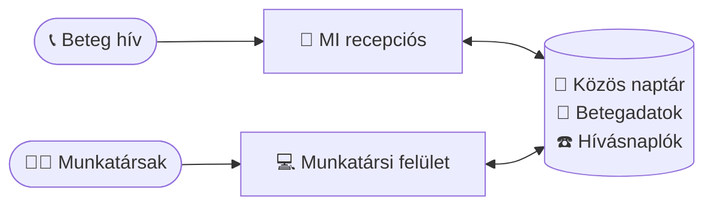
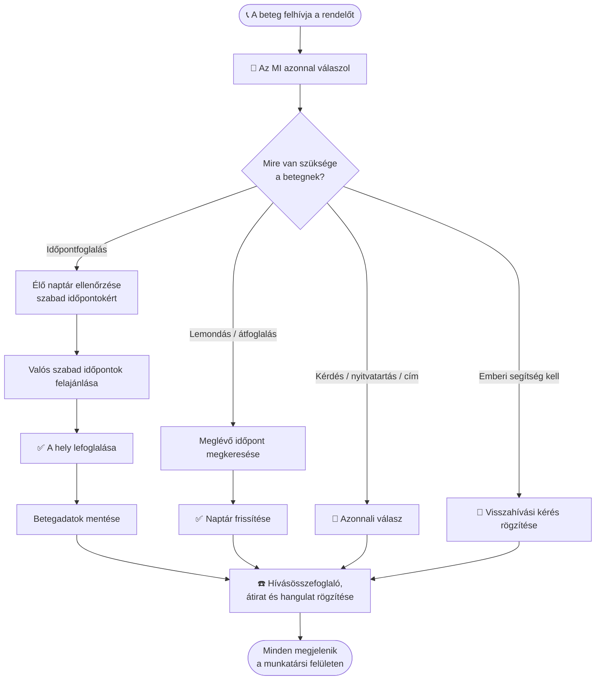

# Sunshine Dental — Felhasználói útmutató

*Közérthető útmutató arról, mit tud ez az alkalmazás, és hogyan használja a rendelője nap mint nap.*

---

## Mi ez, egyetlen mondatban?

Ez egy **éjjel-nappal elérhető, mesterséges intelligenciás telefonos recepciós a fogorvosi rendelőjéhez, plusz egy egyszerű felület, amellyel a csapata kezeli a naptárat, a betegeket és a telefonhívásokat** — mindezt egy helyen.

Képzelje el úgy, mintha felvenne egy fáradhatatlan recepcióst, aki soha nem alszik, soha nem megy ebédelni, és soha nem várakoztatja a hívót — mindezt egy letisztult, modern adminisztrációs felülettel a munkatársai számára.

---

## Az alkalmazás két fele

### 1. Az MI telefonos recepciós 🤖📞

Amikor egy beteg felhívja a rendelőt, egy MI hangasszisztens veszi fel a telefont, és természetes beszélgetést folytat — akárcsak egy valódi recepciós. Képes:

- **Megválaszolni a gyakori kérdéseket** („Mik a nyitvatartási idők?", „Hol találhatók?", „Fogadnak előjegyzés nélkül?")
- **Időpontot foglalni** — ellenőrzi, ki elérhető, valódi szabad időpontokat ajánl fel, és lefoglalja a helyet
- **Lemondani vagy átfoglalni** a meglévő időpontokat
- **Felvenni az új beteg adatait** (név, telefonszám, a látogatás oka)
- **Visszahívási kérést kezelni**, ha emberi munkatársnak kell visszajeleznie
- **Több nyelven beszélni**, így szélesebb közösséget szolgálhat ki

A lényeg: éjjel-nappal működik. Egy fájó foggal küzdő beteg vasárnap este 9-kor is tud időpontot foglalni hétfő reggelre — nincs elszalasztott hívás, nincs tele hangposta, nincs elvesztett bevétel.

### 2. A munkatársi felület 💻

Ez az a webes képernyő, amelyre a csapata bejelentkezik. Itt tartják kézben az emberek mindazt, amit az MI csinál. Innen a munkatársak látnak minden időpontot, kezelik a naptárat, betegeket keresnek ki, és átnézik, mi történt minden telefonhívás során.

A munkatársak saját e-mail-címmel és jelszóval jelentkeznek be:

---

## Hogyan kapcsolódik mindez össze

Az MI recepciós és a munkatársi felület **egyetlen közös naptárat és egyetlen közös betegnyilvántartást** használ — így minden automatikusan szinkronban marad. Az MI kezeli a telefont; a csapata a felületről felügyel.

## Mi történik egy hívás során

Íme egyetlen telefonhívás útja — a csengéstől a lefoglalt időpontig:

---

## Mit tehet a csapata a felületen

### 📊 Vezérlőpult (kezdőképernyő)
Gyors „hogy állunk ma" áttekintés — a mai időpontok, a visszahívásra váró betegek, hány hívás érkezett ezen a héten, és mennyire elégedetten csengtek le a hívók.

### 📅 Naptár
Az alkalmazás szíve. Vizuális heti/napi/havi naptár, amely megjeleníti az összes időpontot és minden fogorvos munkaidejét.

- **Munkaidő beállítása** — jelölje meg, mikor foglalható az egyes szolgáltatók ideje
- **Idő lefoglalása** — ebédszünetek, megbeszélések, adminisztratív idő
- **Szabadságok megjelölése** — szabadnapok, hogy ne foglaljanak le semmit, amíg a fogorvos távol van
- **Időpontok foglalása, áthelyezése vagy lemondása** egyszerű kattintással és fogd-és-vidd módszerrel
- Lássa **az összes szolgáltatót egymás mellett**, hogy a recepció egy pillantással átlássa az egész rendelőt

Az MI recepciós ugyanezt a naptárat olvassa — így mindig csak a valóban szabad időpontokat ajánlja fel. Nincs dupla foglalás.

### 👥 Betegek
Egyszerű címjegyzék mindenkiről, aki kapcsolatba lépett a rendelővel. Az MI automatikusan ide veszi fel az új hívókat, a munkatársak pedig kereshetnek, megtekinthetik az előzményeket és frissíthetik az adatokat.

### 📋 Időpontok
Letisztult lista minden időpontról — közelgő, befejezett vagy lemondott. Szűrjön nap, fogorvos vagy beteg szerint. Jelölje a látogatásokat befejezettnek, amikor megtörténtek.

### ☎️ Hívásnaplók
Minden telefonhívás rögzítése, amelyet az MI kezelt, beleértve:
- Egy írott **összefoglalót** arról, miről szólt a hívás
- A teljes **átiratot** (szóról szóra), ha kíváncsi a részletekre
- Hogyan **érezte magát** a hívó (pozitív / semleges / elégedetlen)
- Hogy a hívás **sikeres** volt-e

Ez az Ön minőség-ellenőrző ablaka — mindig láthatja pontosan, mit mondott és tett az MI.

### 👤 Felhasználók (Adminok)
A tulajdonosok és vezetők itt kezelik a csapatukat — munkatársi fiókokat hoznak létre, és beállítják mindenki szerepkörét.

### ⚙️ Beállítások
Személyes fiókbeállítások — frissítse a nevét, változtassa meg a jelszavát, és (fogorvosok esetén) delegálja a naptárát egy asszisztensnek. A nyelvet és a világos/sötét témát bármikor átválthatja a felső sávból.

---

## Ki mit használ (szerepkörök)

A különböző munkatársak különböző dolgokat látnak, így mindenki pontosan azt a hozzáférést kapja, amire szüksége van:

| Szerepkör | Mit csinál |
|------|--------------|
| **Szolgáltató** (fogorvos) | Saját naptárát és elérhetőségét kezeli, látja a saját időpontjait, befejezettnek jelöli a látogatásokat |
| **Asszisztens** (recepció) | Az egész rendelőt kezeli — minden naptárat, minden időpontot, betegadatokat és hívásnaplót |
| **Admin** (tulajdonos / vezető) | Mindent a fentiekből, plusz munkatársi fiókok létrehozása és a csapat kezelése |

Egy fogorvos a naptárát **delegálhatja** is egy asszisztensnek — így a recepció a nevében kezelheti a beosztását.

---

## Egy nap az életből

**Este 8:55, zárás után.** Egy beteg letört foggal hív. Az MI válaszol, megtalálja a következő szabad sürgősségi időpontot másnap reggel 9:00-ra Dr. Nagynál, lefoglalja, felveszi a beteg nevét és telefonszámát, és megerősíti. Emberi közreműködés nélkül.

**Másnap reggel 9:05.** A recepciós asszisztens bejelentkezik. A vezérlőpult már mutatja az új, reggel 9:00-s időpontot a naptárban, és az új beteget a rendszerben. Elolvassa a hívásösszefoglalót, látja, hogy minden rendben van, és előkészíti a rendelőt.

**A nap folyamán.** A betegek átfoglalni hívnak, a nyitvatartásról kérdeznek, vagy visszahívást kérnek. Az MI kezeli a rutinszerű eseteket; bármi szokatlan rögzítésre kerül, hogy a munkatársak utánajárhassanak. A csapat a székben ülő betegekre fordítja az idejét — nem a telefonra ragadva.

---

## Miért szeretik a rendelők

- **Egyetlen hívás sem marad le** — minden hívás megválaszolásra kerül, éjszaka, hétvégén és ünnepnapokon is
- **Nincs többé telefonos pingpong** — a betegek azonnal, maguk foglalnak
- **Kevesebb meg nem jelenés** — az időpontokat a foglalás pillanatában megerősítik és rögzítik
- **Tehermentesíti a recepciót** — a munkatársak a személyes betegekre koncentrálnak a telefon helyett
- **Teljes átláthatóság** — minden hívás összefoglalva és rögzítve van, így mindig Ön irányít
- **A betegek nyelvén beszél** — a közösség nagyobb részét szolgálja ki
- **Egyetlen egyszerű rendszer** — naptár, betegek és hívások egy helyen (nincs több zsonglőrködés táblázatokkal és külön naptárakkal)

---

## Gyakran ismételt kérdések

**Az MI helyettesíti a munkatársaimat?**
Nem — az ismétlődő telefonos munkát végzi el, hogy a csapata a betegekre koncentrálhasson. A munkatársai a felületen keresztül teljes kontroll alatt tartanak mindent.

**Mi van, ha az MI nem tud kezelni egy hívást?**
Rögzíti a kérést (beleértve a visszahívási kéréseket is), hogy egy ember utánajárhasson. A Hívásnaplókban mindent lát.

**Láthatom, mit mondott az MI egy betegnek?**
Igen. Minden híváshoz teljes írott átirat és összefoglaló tartozik a Hívásnaplókban.

**Foglal-e dupla időpontot?**
Nem. Az MI csak az élő naptárból foglal, így csak a valóban szabad időpontokat ajánlja fel.

**Bizalmasan kezeli a betegadatokat?**
Igen. A hozzáférés szerepkör szerint korlátozott, a fiókok jelszóval védettek, és csak az arra jogosult munkatársak jelentkezhetnek be.

---

*Kérdése van, vagy szeretne egy bemutatót? Vegye fel velünk a kapcsolatot — szívesen tartunk élő demót.*
