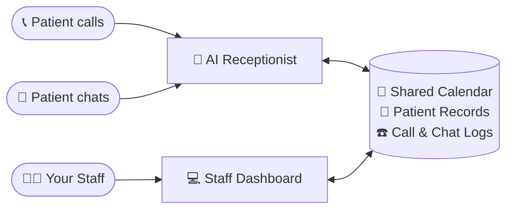
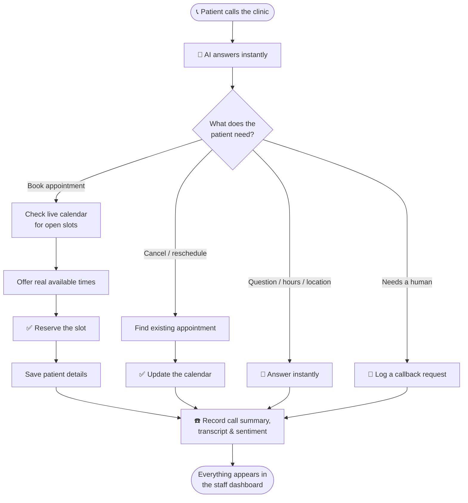
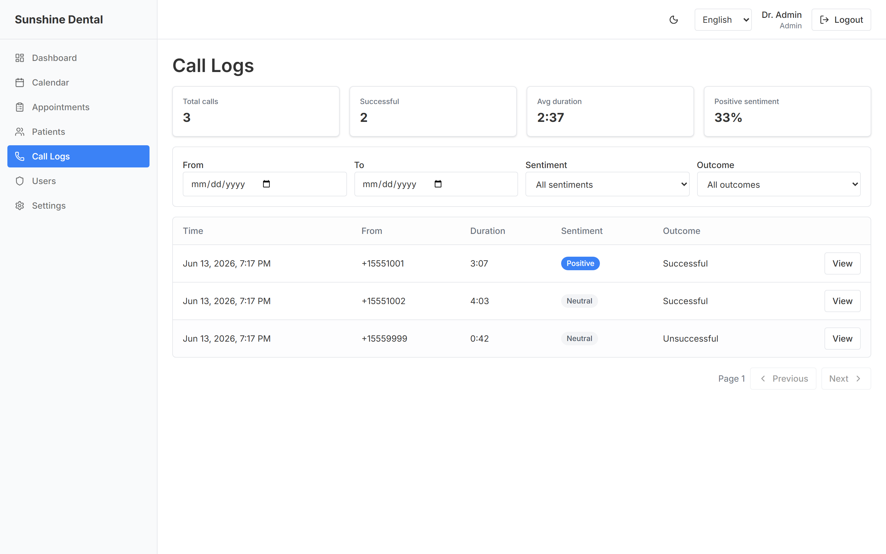
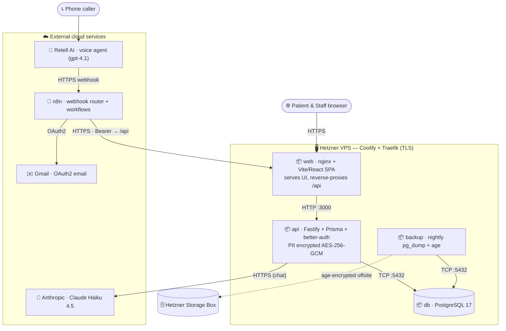

# Sunshine Dental — User Guide

*A plain-English guide to what this app does and how your clinic uses it every day.*

---

## What is this, in one sentence?

It's a **24/7 AI receptionist for your dental clinic — answering your phone *and* chatting on your website — plus a simple dashboard your team uses to manage the calendar, patients, calls and chats** — all in one place.

Think of it as hiring a tireless front-desk assistant who never sleeps, never takes a lunch break, and never puts a caller on hold — working alongside a clean, modern admin screen for your staff.

---

## 🎧 Hear a real call

Don't take our word for it — here's a **real call** the AI receptionist handled end-to-end, from greeting to a confirmed appointment. Press play and listen in.

<audio controls preload="none" src="assets/screenshots/latest-call.mp3"></audio>

---

## The three parts of the app

### 1. The AI Phone Receptionist 🤖📞

When a patient calls your clinic, an AI voice agent picks up and has a natural conversation — just like talking to a real receptionist. It can:

- **Answer common questions** ("What are your hours?", "Where are you located?", "Do you take walk-ins?")
- **Book appointments** — it checks who's available, offers real open time slots, and reserves the spot
- **Cancel or reschedule** existing appointments
- **Take down new patient details** (name, phone, reason for visit)
- **Handle callback requests** when a human needs to follow up
- **Speak more than one language**, so you can serve a wider community

The key point: it works around the clock. A patient with a toothache at 9 PM on a Sunday can still book an appointment for Monday morning — no missed calls, no full voicemail box, no lost business.

### 2. The Chat Receptionist 💬

The same AI receptionist also lives on your website as a **text chat** — for the growing number of patients who would rather type than call. It greets visitors, answers questions, and books, moves or cancels appointments from the same live calendar as the phone agent, in the patient's own language (the language can be switched right in the chat header).

A few things worth knowing:

- **It always asks for an email before booking**, so every chat booking gets a confirmation email automatically — nothing is left unconfirmed.
- **Patients can install it like an app** on their phone (one tap from the browser) — your clinic gets its own icon on their home screen, with no app store involved.
- **Every conversation is summarized and logged** for your staff, just like phone calls (see Chat Logs below).

### 3. The Staff Dashboard 💻

This is the web screen your team logs into. It's where the humans stay in control of everything the AI does. From here, staff can see every appointment, manage the calendar, look up patients, and review what happened on every phone call.

Staff sign in with their own email and password:

---

## How it all fits together

The AI receptionist and your staff dashboard share **one calendar and one patient list** — so everything stays in sync automatically. The AI handles the phone; your team supervises from the dashboard.

## What happens on a call

Here's the journey of a single phone call — from ring to booked appointment:

---

## What your team can do in the dashboard

### 📊 Dashboard (home screen)
A quick "how are we doing today" overview — today's appointments, patients waiting for a callback, how many calls came in this week, and how happy callers sounded.

### 📅 Calendar
The heart of the app. A visual weekly/daily/monthly calendar showing all appointments and each dentist's working hours.

- **Set working hours** — mark when each provider is available for bookings
- **Block off time** — lunch breaks, meetings, admin time
- **Mark vacations** — time off, so nothing gets booked while a dentist is away
- **Book, move, or cancel appointments** with simple clicks and drag-and-drop
- See **all providers side-by-side** so the front desk can manage the whole clinic at a glance

The AI receptionist reads from this same calendar — so it only ever offers time slots that are genuinely free. No double-bookings.

### 👥 Patients
A simple address book of everyone who's contacted the clinic. The AI automatically adds new callers here, and staff can search, view history, and update details.

### 📋 Appointments
A clean list of every appointment — upcoming, completed, or cancelled. Filter by day, by dentist, or by patient. Mark visits as completed when they're done.

### ☎️ Call Logs
A record of every phone call the AI handled, including:
- A written **summary** of what the call was about
- The full **transcript** (word-for-word) if you want the details
- How the caller seemed to **feel** (positive / neutral / unhappy)
- Whether the call was **successful**

This is your quality-control window — you can always see exactly what the AI said and did.

### 💬 Chat Logs
The same transparency for the chat receptionist: every website conversation is listed with its **language, message count, sentiment and outcome**, plus a written summary (in the patient's language) and the full transcript on demand.

### 👤 Users (Admins)
Owners and managers manage their team here — creating staff accounts and setting each person's role.

### ⚙️ Settings
Personal account preferences — update your name, change your password, and (for dentists) delegate your calendar to an assistant. Language and light/dark theme are toggled any time from the top bar.

---

## Who uses what (roles)

Different staff members see different things, so everyone gets exactly the access they need:

| Role | What they do |
|------|--------------|
| **Provider** (Dentist) | Manages their own calendar and availability, sees their own appointments, marks visits complete |
| **Assistant** (Front desk) | Manages the whole clinic — all calendars, all appointments, patient records, and call logs |
| **Admin** (Owner / Manager) | Everything above, plus creating staff accounts and managing the team |

A dentist can also **delegate** their calendar to an assistant — letting the front desk manage their schedule on their behalf.

---

## A day in the life

**8:55 PM, after hours.** A patient calls with a chipped tooth. The AI answers, finds the next available emergency slot tomorrow at 9:00 AM with Dr. Nagy, books it, takes the patient's name and number, and confirms. No human involved.

**9:05 AM, next morning.** The front desk assistant logs in. The dashboard already shows the new 9:00 AM appointment on the calendar and the new patient in the system. She reads the call summary, sees everything is in order, and gets the room ready.

**Throughout the day.** Patients call to reschedule, ask about hours, or request callbacks. The AI handles the routine ones; anything unusual is logged for staff to follow up. The team spends its time on patients in the chair — not stuck on the phone.

---

## Why clinics love it

- **Never miss a call** — every call is answered, even nights, weekends, and holidays
- **No more phone tag** — patients book themselves, instantly
- **Fewer no-shows** — appointments are confirmed and recorded the moment they're made
- **Free up your front desk** — staff focus on in-person patients instead of the phone
- **Full transparency** — every call is summarized and recorded, so you're always in control
- **Speaks your patients' languages** — serve more of your community
- **Meets patients where they are** — phone for some, website chat for others, one shared calendar behind both
- **Patient data stays truly private** — encrypted with a key only your clinic holds, and backed up every night
- **One simple system** — calendar, patients, calls and chats all in one place (no more juggling spreadsheets and separate calendars)

---

## 🔐 How your patients' data is protected

Patient records are medical data, and this app treats them that way — with protections you can explain to a patient in one breath.

### Encrypted, with a key only your clinic holds

All patient personal data (names, phone numbers, appointment notes, call and chat transcripts) is stored **encrypted** with AES-256 — the same encryption family used in online banking. The encryption key belongs to **your clinic alone**: it is never stored on the server and never held by us. Practically, that means someone who stole the database — or even the server's disks — would see only unreadable ciphertext.

There's a visible, everyday side to this: whenever the system restarts (for example after an update), it comes back **locked**. Staff can still log in and see the calendar, but patient names show as `••••` until an administrator enters the clinic's key — a 10-second routine:

The banner even shows a short "fingerprint" of the expected key, so the admin can tell at a glance they're about to use the right one — without the key itself ever being displayed.

### Backed up every night — in a form even we can't read

Every night at 3 AM the system automatically backs up the **entire database**, encrypts the backup, and keeps 90 days of history. The clever part: backups are encrypted with a method where the server can *create* them but can never *read* them back — only your clinic's sealed **recovery key** (a printed document kept in the clinic safe) can open a backup.

- **If the server is ever lost** (hardware failure, disaster), the newest backup is restored and unlocked with your usual key. This restore procedure isn't theoretical — it's rehearsed with regular fire drills.
- **If the clinic ever loses its key**, the sealed recovery document in your safe can recover it. No data loss, no calling the vendor to ask for a copy — we never had one.
- And if *both* were lost? Then the data is unrecoverable — **by design**. That's not a flaw; it's the proof that nobody outside your clinic can ever read your patients' records.

---

## Under the hood — how it's deployed

*For the technically curious: here's the actual system behind the friendly front desk.* The whole product runs as a small set of Docker containers on a single **Hetzner VPS** (managed with Coolify, which also terminates HTTPS at the edge), talking to a handful of specialised cloud services for voice, chat and email.

- **Hetzner VPS (Coolify + Traefik)** — one Docker stack with TLS at the edge. The very same stack is deployed twice, as fully separate production (`sunshine.appointer.hu`) and staging (`sunshinedev.appointer.hu`) environments.
- **`web` / `api` / `db` / `backup` containers** — nginx serves the React single-page app and reverse-proxies `/api`; a Fastify API holds the business logic; an in-stack PostgreSQL 17 database stores everything; and a nightly job takes an encrypted backup.
- **Retell AI → n8n → API** — the phone path. The Retell voice agent calls an n8n workflow, which routes each request to the API over HTTPS with a bearer key; the answer travels straight back on the same connection, so callers get live, real-calendar availability.
- **Anthropic Claude Haiku 4.5** — the website chat path. The API talks to Claude directly (no workflow hop) and reuses the exact same booking logic as the phone agent.
- **Gmail (OAuth2)** — booking confirmations, call summaries and error alerts are all sent from n8n through Gmail.
- **Encrypted, clinic-held keys** — patient data is encrypted with a key only the clinic holds, and the nightly backups are sealed with a separate offsite key (see *How your patients' data is protected* above).

---

## Frequently asked questions

**Does the AI replace my staff?**
No — it handles the repetitive phone work so your team can focus on patients. Your staff stays fully in control through the dashboard.

**What if the AI can't handle a call?**
It records the request (including callback requests) so a human can follow up. You see everything in the Call Logs.

**Can I see what the AI told a patient?**
Yes. Every call has a full written transcript and summary in the Call Logs.

**Will it double-book us?**
No. The AI books only from your live calendar, so it only offers slots that are actually free.

**Is patient information kept private?**
Yes, on several levels. Access is restricted by role and password. Beyond that, all patient personal data is stored **encrypted**, and the encryption key is held only by your clinic — not by us, not on the server. Nightly backups are encrypted the same way. See "How your patients' data is protected" above.

**What happens if the AI chat can't help, or the system is being updated?**
The chat politely says it's temporarily unavailable and patients can still call. Staff-side, updates briefly "lock" patient data until an admin re-enters the clinic key — the calendar keeps working throughout.

---

*Questions or want a walkthrough? Get in touch — we're happy to give you a live demo.*
